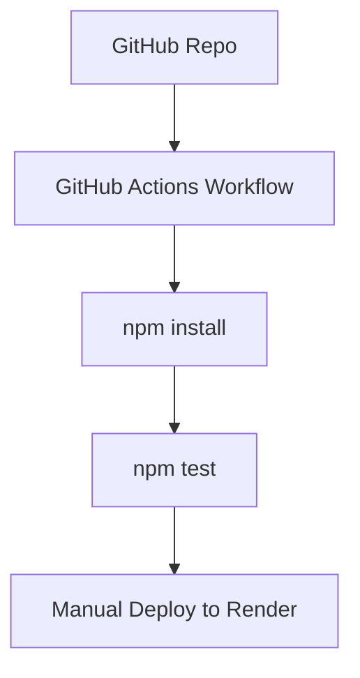

# CI/CD Demo App

This is a simple Node.js + Express application to demonstrate a CI/CD pipeline using GitHub Actions and Render.

---

## Features

- Express backend with a `/hello` route
- Jest test suite for endpoint testing
- CI/CD pipeline using GitHub Actions:
  - Installs dependencies
  - Runs tests on each push to `main`
  - Triggers manual deployment to Render

---

## Usage

```bash
npm install
npm test
npm start
```

## Secrets & Secure Variables

- `FAKE_API_KEY`: Simulates secure key usage in CI environment.
- `RENDER_DEPLOY_HOOK`: Private webhook to trigger automatic deployment to Render after tests pass.

## Test Logs

All test results are saved and uploaded as artifacts in each workflow run.  
They can be downloaded from the GitHub Actions "Artifacts" section.

## Live Deployment

This app is deployed on **Render** using Node.js free tier.

[Live App](https://cicd-project-a0b7.onrender.com)

- Main route: / → Welcome message
- API route: /hello → JSON response

## CI/CD Pipeline



## CI/CD Tools and Justification

- **GitHub Actions**: Chosen for its tight GitHub integration, ease of setup, and strong community support. It automates install, test, and workflow triggers on push/pull_request.
- **Render**: A PaaS that simplifies deployment. It integrates easily with GitHub, offers a generous free tier, and eliminates complex cloud setup.
- **Jest + Supertest**: Used for fast, reliable HTTP endpoint testing.

### Alternatives Considered

| Tool             | Why Not Chosen                            |
| ---------------- | ----------------------------------------- |
| GitLab CI        | Requires self-hosting or GitLab repo      |
| AWS CodePipeline | Too complex for the scope of this project |
| Heroku           | Recently removed free tier                |

## Possible Improvements

- Add persistent test log storage (e.g., upload results to AWS S3).
- Trigger automatic deploy to Render via GitHub webhook.
- Add CI step to lint/format code or check test coverage.
- Add environment variable support and use `.env` file.
